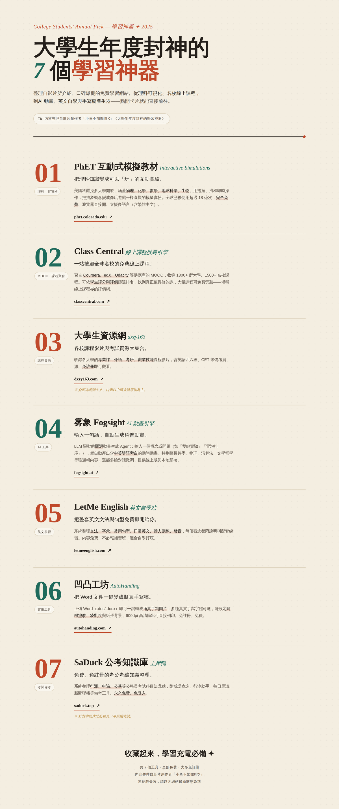

# 大學生年度封神・學習神器 7 選 ✦
### College Students' Annual Pick — 7 Free Learning Tools

整理自影片創作者「小鱼不加咖啡X」《大學生年度封神的學習神器》，集合 **7 個免費、大多免註冊**的學習網站，做成一頁式網頁。從理科可視化、名校線上課程，到 AI 動畫、英文自學與手寫稿產生器，點開卡片就能直接前往。

*A single-page site collecting **7 free (mostly no-signup) learning websites** featured in the video by creator "小鱼不加咖啡X". From STEM visualization and top-university online courses to AI animation, English self-study, and a handwriting-sheet generator — tap a card to go straight there.*

> 🔗 **線上瀏覽 / Live demo（GitHub Pages）**：`https://ismeterry-chiang.github.io/edu-sites/`
> 啟用 Pages 後即可使用；github.io 網域為小寫 / Available once Pages is enabled; the github.io domain is lowercase.

---

## 🖼️ 預覽 / Preview



---

## 📚 收錄工具 / The Tools

| # | 網站 / Site | 連結 / Link | 功能簡介 / What it does |
|:-:|------|------|----------|
| 1 | **PhET 互動式模擬教材**<br>*Interactive Simulations* | [phet.colorado.edu](https://phet.colorado.edu) | 物理／化學／數學／地科／生物互動模擬，把理科知識可視化，免費、支援繁體中文。<br>*Physics / chemistry / math / earth-science / biology simulations that make STEM concepts playable. Free, supports Traditional Chinese.* |
| 2 | **Class Central** | [classcentral.com](https://www.classcentral.com) | 聚合 Coursera／edX／Udacity 等名校 MOOC，可依學生評分篩選排名，大量課程免費旁聽。<br>*Aggregates MOOCs from Coursera/edX/Udacity etc.; rank by student ratings, many courses free to audit.* |
| 3 | **大學生資源網**<br>*dxzy163* | [dxzy163.com](https://www.dxzy163.com) | 各校專業課、外語、考研、四六級等課程影片與備考資源，免註冊。<br>*Lecture videos & exam-prep resources by subject; no signup. (Simplified-Chinese UI, mainland-China curriculum.)* |
| 4 | **雾象 Fogsight**<br>*AI animation engine* | [fogsight.ai](https://fogsight.ai) | 輸入一句話自動生成含中英雙語旁白的科普動畫，擅長數理與演算法，開源。<br>*Type one sentence to auto-generate a bilingual narrated explainer animation; great for math/physics/algorithms. Open-source.* |
| 5 | **LetMe English** | [letmeenglish.com](https://letmeenglish.com) | 文法／字彙／句型／聽力／發音英文自學站，每個觀念附說明與配套練習。<br>*Free English self-study: grammar, vocab, sentence patterns, listening, pronunciation — each topic with explanations and practice.* |
| 6 | **凹凸工坊 AutoHanding** | [autohanding.com](https://www.autohanding.com) | Word 一鍵轉擬真手寫稿，多種手寫字體、可設隨機塗改、600dpi 列印，免註冊。<br>*One-click converts a Word file into a realistic handwritten sheet; multiple fonts, random smudges, 600dpi print. No signup.* |
| 7 | **SaDuck 公考知識庫**<br>*上岸鸭* | [saduck.top](https://saduck.top) | 行測／申論／公基免費知識整理，附成語查詢、行測助手等工具。<br>*Free civil-service-exam knowledge base with study tools. (For mainland-China civil-service exams.)* |

> ※ 第 3、7 項偏中國大陸學制／考試，台灣使用者參考時請留意適用範圍。<br>
> *Note: items 3 & 7 target mainland-China curriculum/exams; relevance may vary for users in Taiwan.*

---

## 🚀 部署 / 更新 / Deploy & Update（GitHub Pages）

本專案為**單一 `index.html`**，無需建置工具。/ *This is a **single `index.html`** — no build step needed.*

1. 將 `index.html` 與 `preview.png` 上傳到 repo 根目錄（首頁檔名須為 `index.html`）。<br>*Upload `index.html` and `preview.png` to the repo root (the homepage file must be named `index.html`).*
2. 進入 **Settings → Pages**。/ *Go to **Settings → Pages**.*
3. **Source** 選 `Deploy from a branch`，分支 `main`、資料夾 `/ (root)`，按 **Save**。<br>*Set **Source** to `Deploy from a branch`, branch `main`, folder `/ (root)`, then **Save**.*
4. 約一分鐘後開啟 / *After ~1 min, open*：`https://ismeterry-chiang.github.io/edu-sites/`

**更新內容 / To update**：編輯 `index.html` 後 commit 到 `main`，Pages 會自動重新發佈。/ *Edit `index.html`, commit to `main`, and Pages redeploys automatically.*

---

## 🗂️ 檔案結構 / File structure

```
.
├── index.html      # 網頁本體（單檔，含 HTML / CSS）/ the page (single file)
├── preview.png     # README 預覽圖 / preview image for this README
└── README.md       # 專案說明 / project readme
```

---

## 🎨 技術說明 / Tech notes

- 純 **HTML + CSS**，無框架、無建置流程、可離線開啟。/ *Plain HTML + CSS, no framework, works offline.*
- 字體 / Fonts：`Fraunces`（英文標題 / display）、`Noto Serif TC`（中文標題 / headings）、`Noto Sans TC`（內文 / body），由 Google Fonts 載入。
- 紙感編輯風設計，支援桌機與手機 RWD，外部連結皆另開分頁。/ *Editorial paper aesthetic, responsive, links open in new tabs.*

---

## 📌 備註 / Notes

- 內容整理自影片創作者「**小鱼不加咖啡X**」《大學生年度封神的學習神器》。/ *Content compiled from the video by creator "小鱼不加咖啡X".*
- 各網站之服務、網址與是否免費，請以該網站**最新狀態**為準。/ *Services, URLs, and pricing follow each site's current state.*
- 本專案僅作學習資源彙整用途，與上述各網站無隸屬關係。/ *This project is a resource roundup only and is not affiliated with the listed sites.*
